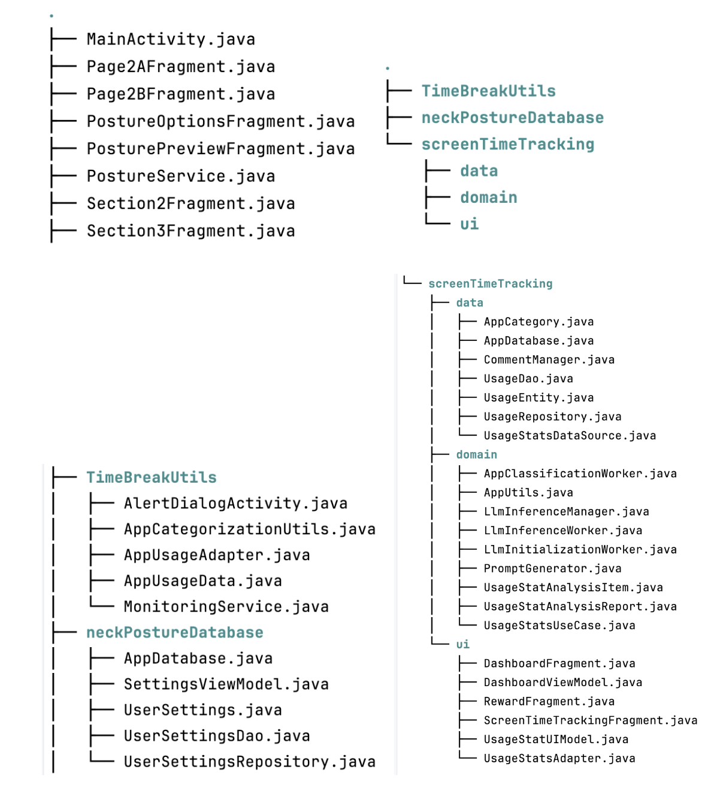

# Health App

## Overall App Layout

Users can track screen time usage, receive AI-generated comments on
productivity, set up Pomodoro timer and monitor his neck posture. Users
can navigate between and within the 3 main features through sidebar and
bottom navbar respectively. No internet connection is required in our
app. All sensitive data such as app usage and facial data are processed
offline to protect users' security and privacy.

## Core App Features

### Neck Posture Analysis

One of the features of our Health App is a neck posture analysis and
alert feature. This requires finding the device pitch angle and neck
pitch angle.

#### Device Pitch Angle

To get the pitch angle of the device relative to the ground, device
sensors were used. First, the sensor was initialized with
`getDefaultSensor(Sensor.TYPE_ROTATION_VECTOR)`. A
`SensorEventListener()` is then set up, and once it detects a change, a
rotation vector is obtained from it. That gets converted into a Rotation
Matrix using `getRotationMatrixFromVector()`.

After that the rotation matrix is remapped using
`remapCoordinateSystem()` to realign the device's coordinate system.
This is necessary because by default, the rotation information generated
by the sensor is calculated using the device's natural coordinate system
which isn't intuitive to understand. After remapping, the coordinate
system is translated to our application's frame of reference, which
makes moving the device affect the angles in ways the user expects it
to.

Lastly, after remapping, `getOrientation()` is used on the remapped
matrix to extract the Euler pitch angle from the rotation matrix, which
is then converted to degrees from radian to make it more readable. 90
degrees is also added to it to make a perfectly vertical neck (good
posture) 90 degrees instead of 0, making the final pitch angle more
intuitive to understand.

#### Neck Pitch Angle

The neck pitch angle relative to the device is obtained using a
combination of the front-facing camera, the MediaPipe computer vision
model, and the OpenCV computer vision algorithm library.

Firstly, the cameraX API is used to capture images or live videos of the
user using the front-facing camera with an image output format of
RGBA_8888. This is done by selecting the front facing camera with

`CameraSelector.Builder().requireLensFacing(CameraSelector.LENS_FACING_FRONT)*`

then setting up an image analysis builder with

`ImageAnalysis.Builder().setOutputImageFormat(ImageAnalysis.OUTPUT_IMAGE_FORMAT_RGBA_8888)`

This is converted from **ImageProxy** to **MPImage** for processing. The
next step is to obtain the locations of facial landmarks of the captured
user's face. This is done using the MediaPipe computer vision model,
***face_landmarker.task***, located in **/app/src/main/assets**. In the
background implementation of the posture analysis, the **RunningMode**
is set to **IMAGE** as only individual frames are captured and analysed
to conserve battery, whereas in the live preview implementation the
**RunningMode** is set to **LIVE_STREAM** to handle a constant stream of
frames. The frame is analysed and results are stored in
*result.faceLandmarks()*.* *

The final step is to calculate the neck pitch angle from the facial
landmarks using the OpenCV algorithms. To find the rotation vector of
the head, 3 main things are required. Coordinate points of key facial
landmarks on a generic 3D face model, 2D coordinates of key facial
landmarks on the image you're detecting, and parameters of the camera.
The key facial landmarks selected in this case are the tip of the nose,
chin, left and right eye, and left and right mouth corner. In the end
the 3D and 2D coordinates are used along with the camera parameters in
*Calib3d.solvePnP()* to get a rotation vector. This is converted to a
rotation matrix using *Rodrigues' rotation formula*, and converted to
Euler pitch angle with the following formula

#### Overall Neck Pitch Angle

With the device tilt and neck tilt values they are then combined to
achieve a good estimate of the user's neck tilt angle relative to the
ground. Minor manual adjustments are added to the final pitch angle when
the device pitch is close to completely flat, as it was noticed that
when the difference in angle between the neck tilt and the device tilt
is really large, there is some distortion that makes the computer vision
model detect a lower angle than usual.

Two applications of this feature were added. The first is a preview page
to allow users to test out the posture analysis in real-time, with the
neck tilt, device tilt, and overall tilt angles all displayed on screen.
This operates as described above, with the addition of a function that
updates the UI each time angles are calculated.

The second is a system **PostureService.java** that runs the same
functionality but in the background, with an options frontend that
allows users to turn on/off the feature and customize how it works.
Users can decide on how often images are captured for analysis, whether
or not they receive notifications, and the threshold for what counts as
bad posture. When the feature runs, a notification is sent using
*NotificationCompat.Builder(this, \"posture_channel\")* to notify the
user that it's "*Running in background*". Whenever the user maintains a
bad posture for over 30 seconds consecutively a notification is sent
reminding them to \"*Please adjust your head position for better
posture*\".

### Screen Time Tracking

Screen Time Tracking consists of dashboard and analysis.

#### Dashboard

The dashboard will display the list of user's today app usage. Each list
item will have an editable tag that declares the app category
(PRODUCTIVE, NON_PRODUCTIVE, CLASSIFYING). The list is implemented by
RecyclerView, which uses the efficient Adapter + ViewHolder approach.
Moreover, the list data source is a LiveData managed by ViewModel. Any
change in the database, such as app category changes, will be reflected
in the list immediately. Since DiffUtil is used in the adapter, only the
changed item is re-rendered, avoid resetting the whole list. The
dashboard will refresh automatically when the app resumes, this enables
users to see the latest app usage. Through UsageStatManager and
PackageManager, we can get the data like today app usage, pacakage name,
icon.

#### Analysis

An offline large language model (LLM) is bundled with the app. The model
is the latest Gemma3-1B-1T, with dynamic_int4 weight quantization. It
supports both the CPU and GPU backend. The model size is 555MB. On the
first launch, the LlmInitializationWorker will copy the model from asset
to the user's file system. The app size will be 1.5GB afterwards. If the
installation is successful, the worker will initialize the LLM instance.
The LlmInferenceManager manages the singleton LLM instance and queues
the inference request in a WorkChain, since the LLM cannot handle
parallel inference. The inference work will be carried out by the
LlmInferenceWorker. Due to the model size limit, it can only handle
English. This deviates from the multilingual response described in the
proposal.

The first usage of LLM is to perform binary classification (PRODUCTIVE,
NON_PRODUCTIVE) on the user's installed app. When ScreenTimeTracking
resumes, the app will check for PACKAGE_USAGE_STAT permission in the
background. If the permission is not granted, an alert dialog will
prompt and redirect the user to grant the permission. If permission is
granted, a classification job will be launched by WorkManager as a
OneTimeWorkRequest. Only package name is passed to the LLM. Each
classification takes around 3 seconds, so most of the app classification
can be completed in the first app launch. The result is stored
persistently in the room database.

The second usage of LLM is to generate an encouraging comment on the
user's today app usage. Information such as the total app usage time,
top 5 usage of productivity apps or sample format are passed to LLM. The
comment generation takes around 5 seconds. The result is stored in
SharedPreferences, which allows caching (invalidate after 15 mins) and
persists across app restarts. Users can share the comment as plain text
to other apps.

### Smart Time Break

Smart Time Break consists of Monitoring Service and Duration
Customization.

#### Monitoring Service

The monitoring service is used to monitor user's foreground application
activity.

When user presses the button in page2A, the Page2AFragment module will
continuously monitor user's foreground application activity using
Android's UsageStatsManager to query usage events. Then, the
AppCatergoriztionUtils module reuses data in the room database, in which
Gemma3-1B-1T model determines the type of application (productivity or
non-productivity) and the result is saved in the database. In case the
data does not exist in the database, the module will see the application
as non-productivity.

After that, the application will enter the Work-Break cycle. In Work
period, Smart Time Break tracked the applications' usage time and a
timer of counting down is activated by service in the background. When
timer times out, the MonitoringService handles notifications and alerts
to remind the user to take a break for a default or pre-set duration and
send a broadcast to Page2AFragment for entering the Take Break logic
operation. This functionality is handled by the MonitoringService module
by using Android's NotificationManager to send high-priority
notification, and the AlterDialogActivity module displays dialog boxes
with personalized message to remind the user to take break or resume
their work.

#### Duration Customization

The duration customization provides the functionality of default
duration settings and real time integration.

Page2BFragment module provides the UI to allow users to edit the work
and break duration for productivity software and non-productivity
respectively. When user enters a new value in the EditText view and
presses the save button, the new duration data will access to
Page2AFragment module via the interface of Secction2Fragments module.
Section2FFragment module acts as the parent fragment for the
Page2AFragment module and Page2BFragment module. It stores the default
duration and provides methods to retrieve or update them. Therefore,
Page2AFragments can interact with Page2BFragment.

## Build Instructions

#### Offline AI Packaging
1.  Go to [Model card](https://huggingface.co/litert-community/Gemma3-1B-IT) and  acknowledge the license before downloading the model. Then, navigate to [litert-community/Gemma3-1B-IT](https://huggingface.co/litert-community/Gemma3-1B-IT/tree/main) and download *gemma3-1b-it-int4.task* model (555 MB).

2.  Place the model in the *app/src/main/assets/models/* folder. Create the *assets/models/* subdirectories if they don't exist.

## Reflection
The app is mostly complete, and there are only few deviations from the proposal:

- Due to LLM model size limit, the offline LLM cannot support multilingual response

- Screen is not locked when break, since this could pose severe nuisance to users

- No posture data tracking over time, since the neck posture analysis is really challenging and time-consuming
